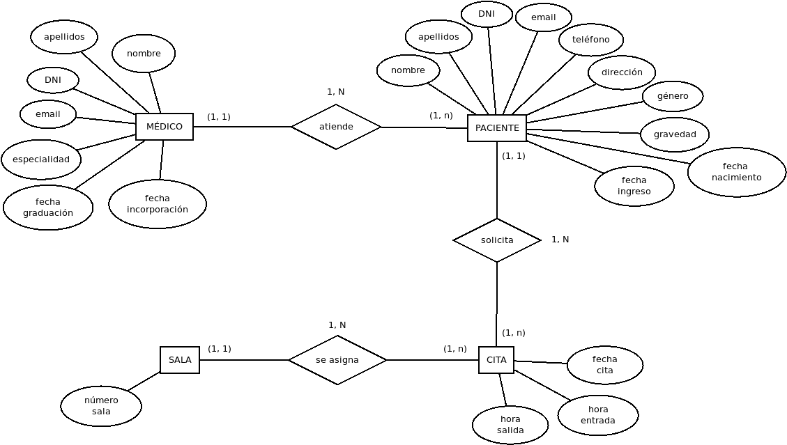
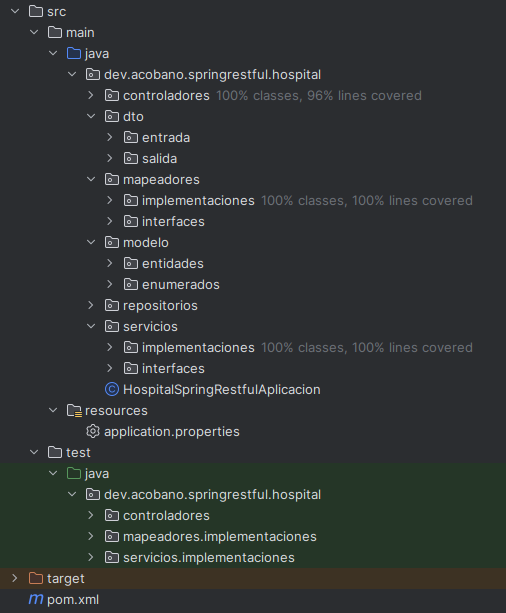
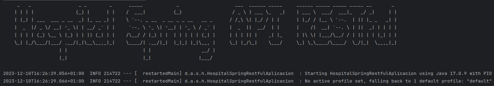
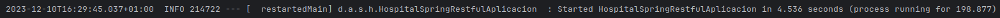
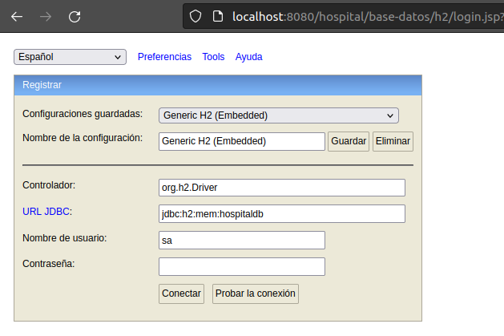
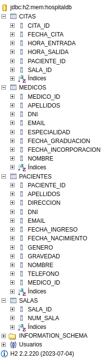
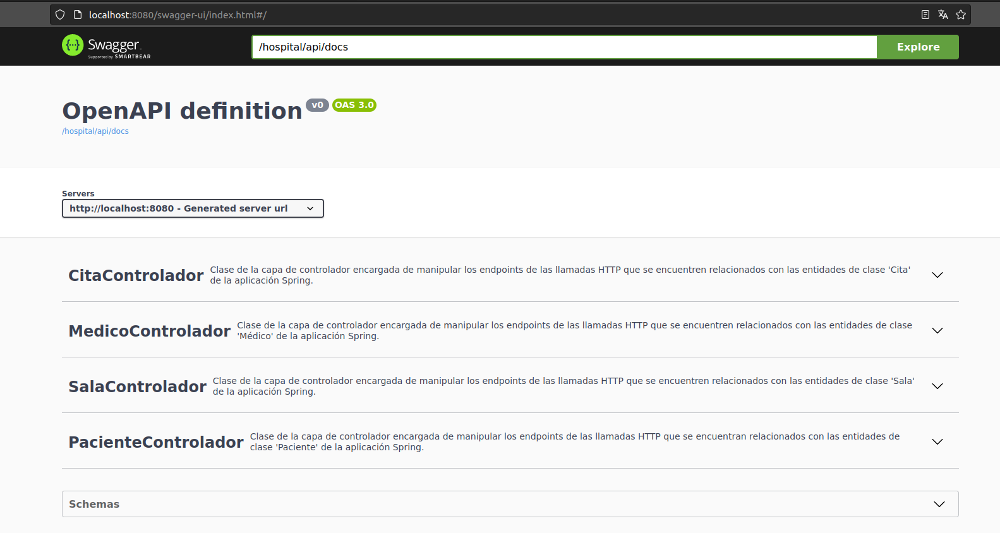

# Hospital Spring API RESTful
### realizado por Álvaro Cobano

## 1. Resumen:
El presente proyecto expone una aplicación Spring que simula con fines instructivos el funcionamiento de un hospital mediante el uso de tecnologías clave como llamadas HTTP bajo API RESTful y JPA con Hibernate para gestionar estas operaciones. A través de una interfaz basada en servicios web, la aplicación permite al usuario realizar operaciones de tipo CRUD de las entidades existentes como médicos, pacientes y citas médicas con una interfaz de configuración muy sencilla y un despliegue limpio. La persistencia de datos se gestiona eficientemente mediante JPA que permite mapeos objeto-relacionales (ORM), transformando directamente objetos Java con tablas de bases de datos relacionales.

## 2. Dependencias utilizadas:
Para llevar a cabo la compleción de la presente aplicación, se ha procedido a introducir las siguientes dependencias mediante el uso del archivo pom.xml del gestor de proyectos Maven:

- **Spring Boot Starter Data JPA:** Dependencia diseñada para usar JPA (Java Persistance APIs), necesaria para Hibernate.
- **Spring Boot Web:** Dependencia diseñada para crear aplicaciones Spring MVC que funcionen mediante microservicios RESTful.
- **Spring Boot DevTools:** Herramientas para desarrollo de aplicaciones Spring Boot.
- **Spring Boot Starter Test:** Dependencia diseñada para crear tests unitarios de aplicaciones Spring Boot, en el que se incluye JUnit5 y Mockito.
- **Spring Boot Starter Validation:** Dependencia dedicada al manejo de validación de entrada de datos a la aplicación.
- **H2**: Base de datos relacional integrada en la aplicación muy ligera y útil para pruebas y desarrollo.
- **Lombok:** Dependencia que reduce el boilerplate eliminando código repetitivo. También incluye la anotación @Slf4j para generar logs eficientes.
- **SwaggerUI:** Herramienta que facilita una documentación inteactiva de desarrollo de APIs y prueba de servicios web.

## 3. Estructura del modelo:
En la presente aplicación existen cuatro entidades con sus correspondientes atributos que conformarán nuestra base de datos:

**TABLA 'MÉDICOS':**
- *Id* (NUMBER)
- Nombre (VARCHAR)
- Apellidos (VARCHAR)
- DNI (VARCHAR)
- Email (VARCHAR)
- Especialidad (ENUMERADO: {"CARDIOLOGIA", "CIRUGIA", "DERMATOLOGIA", "GINECOLOGIA", "OFTALMOLOGIA", "ONCOLOGIA", "PEDIATRIA", "PSIQUIATRIA", "TRAUMATOLOGIA"})
- Fecha de graduación (DATE)
- Fecha de incorporación (DATE)

**TABLA 'PACIENTES':**
- *Id* (NUMBER)
- Nombre (VARCHAR)
- Apellidos (VARCHAR)
- DNI (VARCHAR)
- Género (ENUMERADO: {"MASCULINO", "FEMENINO", "NO_ESPECIFICADO"})
- Email (VARCHAR)
- Dirección (VARCHAR)
- Teléfono (VARCHAR)
- Gravedad de la afección (ENUMERADO: {"ASINTOMATICA", "LEVE", "MODERADA", "GRAVE", "CRITICA"})
- Fecha de nacimiento (DATETIME)
- Fecha de ingreso (DATETIME)

**TABLA 'SALAS':**
- *Id* (NUMBER)
- Número de sala (NUMBER)

**TABLA 'CITAS':**
- *Id* (NUMBER)
- Fecha de la cita (DATE)
- Hora de entrada (TIME)
- Hora de salida (TIME)

Las relaciones existentes entre las anteriores relaciones son las siguientes:
- Un paciente solamente puede ser atendido por un médico.
- Un médico puede atender de uno a varios pacientes.
- Un paciente puede solicitar de una a varias citas.
- Una cita solamente podrá ser solicitada por un solo paciente.
- Una sala puede ser asignada de una a varias citas.
- Una cita solamente tendrá asignada una única sala.

Así pues, el diagrama del modelo entidad-relación (ME-R) de este proyecto será el expuesto a continuación:

## 4. Arquitectura de la aplicación:
Para la realización del presente proyecto, se ha procedido a estructurar las clases Java que la conforman siguiendo una arquitectura de la información similar a la usada ampliamente por otras aplicaciones con protocolos API RESTful, el cual se puede observar con detalle en la siguiente imagen:

Como podemos observar, dentro del directorio 'src/main/java' nos encontramos con seis paquetes divididos bajo el siguiente orden:

**- Modelo:** Es la capa de la aplicación que representa los datos crudos de las tablas que conforman nuestra base de datos.
**- DTO:** Objetos de entrada y salida de datos que se encargan de ejercer de puente entre las entidades del sistema y el usuario.
**- Controladores:** Es la capa de la aplicación encargada de la ejecución de los endpoints con los que el usuario ejecutará llamadas HTTP.
**- Servicios:** Es la capa de la aplicación encargada de gestionar la sección lógica subyaciente a las llamadas de la capa anterior.
**- Repositorios:** Es la capa de la aplicación que realiza las operaciones CRUD traídas desde la capa anterior en la base de datos del sistema.
**- Mapeadores:** Es la capa de la aplicación encargada de transformar los datos almacenados entre las entidades y los DTO de entrada y salida.

Además, debemos destacar la presencia del directorio 'src/test' donde se encuentran desglosados por sus paquetes las diferentes clases de pruebas unitarias y de cobertura de todas aquellas clases que actúen como intercambio de datos (controladores, servicios y mapeadores) mediante el uso de las dependencias externas JUnit5 y Mockito.

## 5. Método de ejecución de la aplicación:
El proceso para arrancar la aplicación contenida en el presente proyecto es muy sencillo. Basta con buscar la clase 'HospitalSpringRestfulAplicacion', situada en el paquete dev.acobano.springrestful.hospital, y ejecutar su método 'main'. Esta acción dependerá del IDE utilizado por el usuario, pero en todos el botón de arranque es bastante fácil de visualizar. Una vez arrancado, aparecerá una consola de salida que mostrará los datos del proceso:

Durante unos segundos, en la pantalla irán apareciendo los datos que está empleando la aplicación Spring para funcionar, como la ejecución de la base de datos H2 o la persistencia de las entidades en JPA. Por último, aparecerá un mensaje indicando que el servicio ya se encuentra levantado satisfactoriamente:

Una vez levantado, podremos utilizar tecnologías como Postman o Swagger para ejecutar llamadas HTTP al puerto 8080 de nuestra máquina local para poder interactuar con la base de datos del sistema.

## 6. Acceso a la base de datos H2:
H2 es una base de datos relacional escrita en Java, diseñada para funcionar de manera eficiente en entornos embebidos y ofrecer una solución ligera para aplicaciones Java. Su característica principal radica en operar completamente en memoria, lo que significa que los datos se almacenan temporalmente en lugar de persistirse en una unidad de almacenamiento. Esto hace que H2 se especialmente útil en entornos de desarrollo y pruebas, donde la velocidad y la simplicidad son prioritarias.

Además ofrece soporte para JDBC, lo que facilita su intrgración con otras herramientas que admitan esas interfaces estándar. H2 se destaca por su ligereza y rapidez, lo que la convierte en una opción eficiente para proyectos que requieren una base de datos integrada y fácil de usar. Su consola web integrada permite administrar y visualizar datos de manera interactiva a través de un navegador, facilitando la gestión y monitorizando el flujo de datos.

Para acceder a la consola H2 por navegador, tendremos que acceder desde un navegador web a la siguiente ruta:

*http://localhost:8080/hospital/base-datos/h2*

La primera vez, se nos abrirá un formulario para que insertemos el nombre de usuario y contraseña necesarios para acceder. Todos los datos necesarios se encuentran en el interior del archivo 'application.properties' de la aplicación.

Una vez introducidos los datos necesarios, se nos desplegará una vista en la que se nos mostrará toda la información disponible para almacenar en las tablas de nuestra base de datos, así como opciones con las que podremos interactuar con ella mediante sentencias de tipo SQL (Structured Query Language). Todos los cambios realizados desde esta pantalla influirán en aquellos objetos que llamemos desde Postman con HTML y viceversa.

## 7. Documentación Swagger:
Swagger UI es una herramienta poderosa utilizada en proyectos de desarrollo de API para simplificar la documentación y prueba de servicios web. Su principal función es generar de manera automática documentación interactiva para APIs basadas en el estándar OpenAPI, proporcionando una interfaz de usuario intuitiva y fácil de usar que permite explorar, entender y probar los endpoints de nuestra aplicación directamente desde el navegador. Su consola de pruebas integrada permite realizar solicitudes HTTP directamente desde la interfaz, agilizando la fase de desarrollo y depuración.

Al igual que con la base de datos H2, es posible acceder al listado de endpoints y esquemas de SwaggerUI desde un navegador web si la aplicación se encuentra debidamente levantada, ingresando la URL:

*http://localhost:8080/swagger-ui/index.html*

Este link servirá de prueba al usuario para consultar y testear en directo los diferentes endpoints de los que constan cada uno de los cuatro diferentes controladores de la aplicación, así como los esquemas de construcción de todos y cada uno de los DTOs que llevan la información del usuario al sistema y viceversa. Así mismo, en la carpeta raíz del presente proyecto se encuentra una colección de Postman con todos los endpoints para poder realizar pruebas también por este canal.
